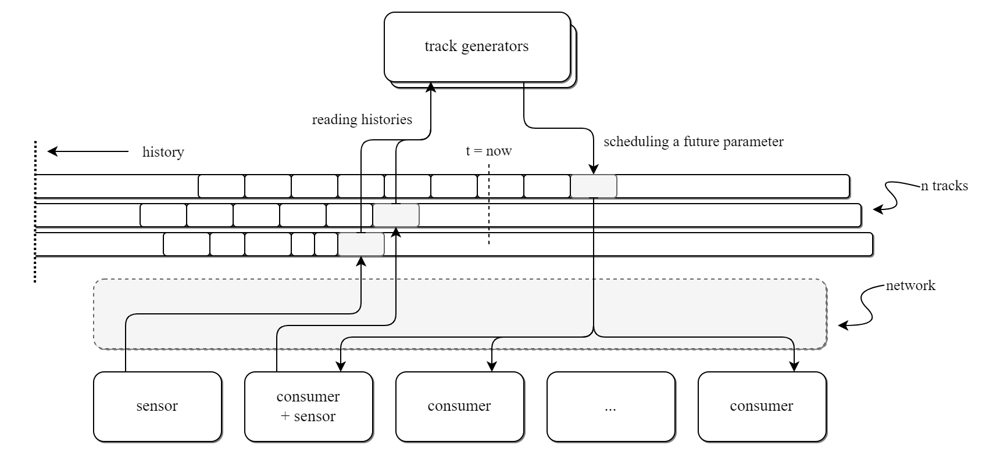
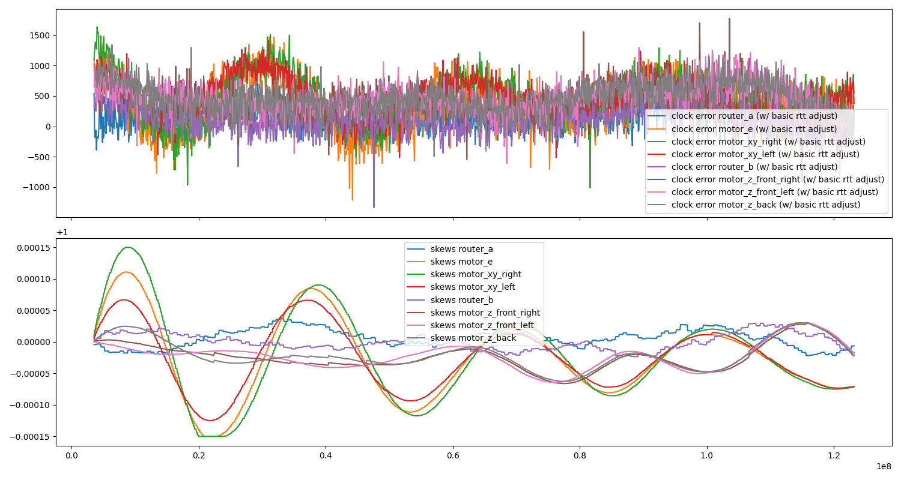
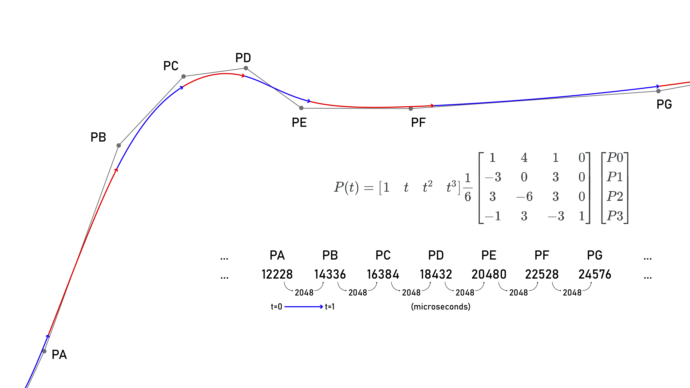
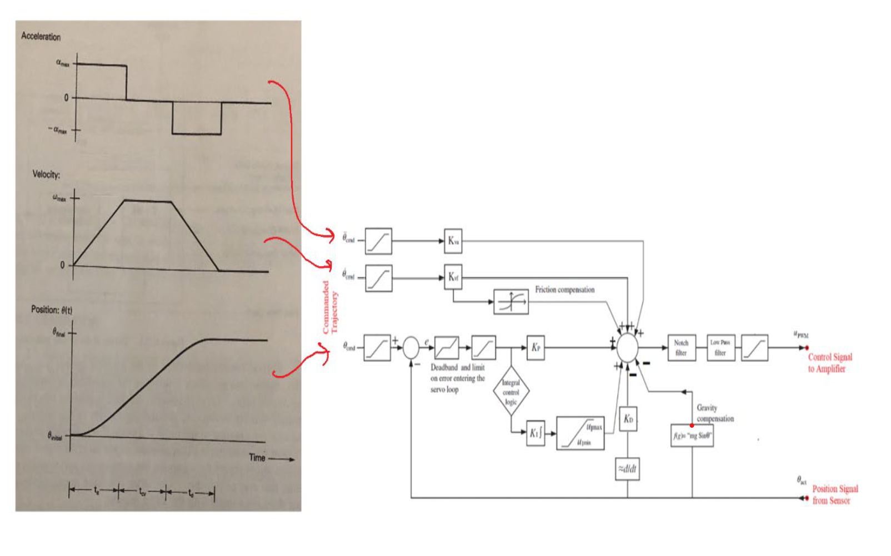
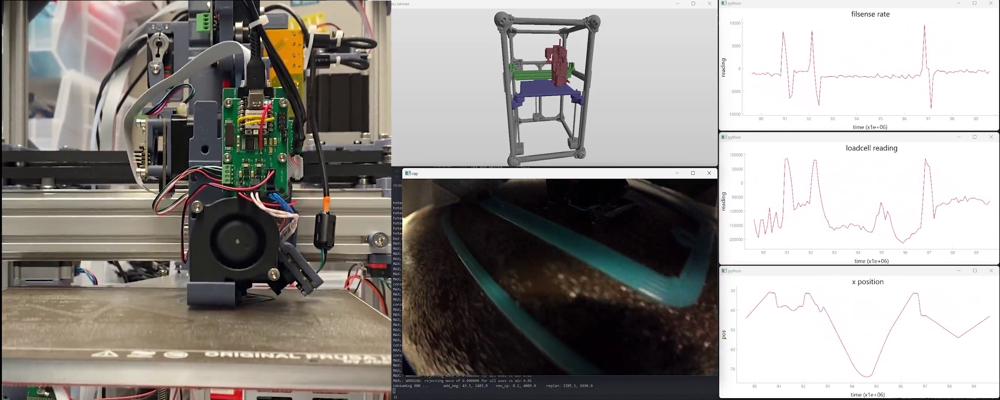

# Distributed Motion Systems Using Clock Synchronization and Time Encoded Trajectories, Commands, and Readings

> Originally published to https://github.com/jakeread/distributed-motion-systems-using-clock-sync-and-time-encoding on March 10th, 2025  

> I hereby dedicate the contents of this disclosure to the public domain so that it may serve as prior art.  

Building control systems for mechatronic systems is an ongoing challenge for roboticists and machine builders. A particular challenge is the development of systems that span multiple computing devices: typically these systems involve one or more "laptop-scale" computers (i.e. with GHz of clock and GBs of memory, and normally running an OS - we will call them "big" devices for short), and one or more "embedded" scale devices (i.e. with MHz of clock and MBs or KBs of memory - "small" devices). Systems that span big- and small computing are common especially in manufacturing, where the orchestration of manufacturing tasks (i.e. computer aided manufacturing - CAM) require big computing, but the execution of tasks (i.e. controlling an actuator's position) requires small computing (which is deterministic, reliable, and safe). 

The problems presented by these systems have mostly to do with time, since any network that connects them is bound to have some message-passing delay - and all networks have some amount of delay 'jitter,' - these both make synchronous control difficult if we simply use 'instantaneous' operation: i.e. executing a new command as soon as it is received means that if we transmit a command to another device, we can never be exactly sure when it will be executed. Similarely, if we poll a sensor in a system, we cannot be sure when the measurement was actually performed. 

I have been developing a system architecture for this problem that uses a clock synchronization service, and develops time stamped encodings for control outputs *and* for sensor readings to coordinate many devices over potentially asynchronous or shaky data links. Primarily becaues it allows me to easily offload complex control tasks to a "big" computer (where they can be more easily developed), the system has allowed me to develop optimization based control for manufacturing equipment that may enable radical improvement in the way we operate our fabrication machinery (and automated equipment more generally). I think that solutions like this one belong in the public domain, and so I am laying out the core systems principles here for public disclosure. 

  
> A diagram of the system's core concepts: a series of devices communicating on a network use tracks to organize consumption and generation of time-series data, encoded as parametric functions of time. By transmitting time-stamped parameters, tracks can be sequentially generated and read by network participants. Writing parameters in the future can be used to schedule execution of control outputs, and time-stamped sensor readings can be written as parameters into the history of other tracks. In a control context, we read historical data (feedback) to generate new control outputs and schedule them in the future. 

The core idea concerns using encoded 'tracks' of information: these are each some $f(t)$ that can be evaluated at any given time given that the correct parameters have been received, and can be written into or read from by any device in a network. A year ago, I was able to write an interim paper on some of these ideas, that's [here](https://dl.acm.org/doi/abs/10.1145/3623263.3623362) [(pdf)](https://cba.mit.edu/docs/papers/23.10.MAXL-Motion.pdf). 

## Clock Synchronization 

The first step is synchronizing device clocks. Timing services for synchronization are common in many networks: *the* internet uses a protcol aptly named Network Time Protocol (NTP) and some devices deploy it's precision cousin, Precision Time Protocol (PTP). NTP, PTP and the solution that I have developed all use regular network packets to synchronize device clocks (which makes it possible to implement them on existing or standard hardware like off-the-shelf personal computers), but it it is also possible to develop lower-level, simpler synchronization solutions. For example, a network of devices may simply implement a hardware clock pulse, with one transmitter (a clock 'grandmaster') and multiple recipients: a clock edge (probably some voltage transition, but maybe also a wireless pulse, or a combination thereof). 

I have developed a very simple, packet-based clock synchronization routine. In this routine, each device runs a synchronization algorithm at some time interval, the routine is as follows:

- at the beginning of an interval, transmit a `stamp_request` message to all neighbouring devices 
- when a `stamp_request` message is received, it is handled by writing the recipients' current clock reading into the packet and returning the packet to the sender as a `stamp_response` 
- when `stamp_response` messages are subsequently received, the device measures the difference between its own timestamp and the received timestamp, making an offset. it uses half of the round-trip-time for the message as an additional offset, to counteract the network delays' effect on stamp measurement 
- if any of the received clocks are substantially older than its own, the device shims their clock to match the old clock 
- otherwise, the device takes an average of the neighbouring offsets and applies a shim to their clock to adjust its rate up (if it is behind everyone else) or down (if it is in front), using a remotely controllable tuning variable 
- skews are also filtered using another tunable variable, to aid in networks where offset measurement is noisy 
- all maths are performed using fixed point arithmetic, for speedy implementation even in simple devices without a floating point unit 

  
> This plot shows clock errors converging over time as the sync algorithm operates. 

This is a simple, fast (low cpu time) and effective solution, but might not suit all networks. More advanced packet based synchronization routines might model others' clocks more carefully, especially in cases where network delay is assymetric, i.e. on a bus archiecture where a host's return ping may be faster than the time it takes to send a message to that device. PTP also makes explicit mention of tighter hardware integration for improved sync performance, i.e. stamping packet arrival time *at the time of byte capture in an interrupt,* reducing jitter that arises between byte ingestion at the hardware layer and packet handling in software. 

## Time Encoding "Tracks" of Trajectories and Other Control Outputs 

A key challenge in these systems is to communicate instructions to other devices: when to move a motor (and how much), when to sample a sensor, turn on a light, etc. In particular, motion is difficult because motion instructions have high spatial and temporal density: a motor needs to know where it should be at any given time to a relatively high degree of precision. 

In the system I'm describing now, we think in terms of various functions of time, so i.e. some motor in the system will be set up so that it can evaluate $x = f(t)$ at any given $t$ - the motor's controller is then responsible for evaluating that function at some interval and ensuring that the output is, at the stated time, realized. This lets us offload low level control of outputs to 'small' devices while keeping authority for their outcomes elsewhere. It is mathematically clean, and we can keep local copies of the history of whichever $f(t)$ we would like for later use, i.e. in generating time-series data aligned with sensor samples. 

Each $f(t)$ needs a stream of parameters to be valid at a given $t$ - but we can generate many types of functions to use. One way to think of this is just as a compression strategy: we encode instructions as continuous functions, and try to design those functions so that we can express a wide array of outputs using a smaller subset of functions and parameters... 

### Basis Spline Encodings

The most productive encoding that I have used to date is a form of basis spline. These have the property that parameters can be added continuously, and they form continuous functions with clearly defined derivatives that can be quick to evaluate on small cpus, and they are naturally continuous in position, velocity, and acceleration: this makes them an excellent candidate for all types of physical systems, especially motion (unless it is exceptionally small, nothing moves without first accelerating...).

  
> The basis spline encoding, showing a series of parameters and their timestamps, as well as the matrix formulation of the spline. For example in the interval between `PC and PD`, we use points `PB, PC, PD and PE` as `P0, P1, P2 and P3` ... The formulation allows us to sequentially add new parameters to the tail of this queue to extend the function. 

For basis splines, I also pick a fixed interval for each parameter, and I pick an interval that is *some power of two* microseconds, i.e. 512, 1024 ... 16384 us. This last detail means it is easy to evaluate the splines using fixed point arithmetic, again for microcontrollers that may not have a floating point unit (FPU). 

The basis spline can be used directly as a position variable, which can be used by i.e. stepper motors (who issue steps autonomously such that they track the position) or by servo motors (who use it as a setpoint for a closed-loop controller). Using $f(t)$ also means that servo motors can do some *look ahead* for their control loops, seeing where they will need to be in the future. 

Servos (or any feedback controller) may also track multiple splines, some of which can be used to adjust control loops' internal variables through time. For example, many servo loops use feed-forward terms to compensate for known masses and frictions. In motion systems with nonlinear kinematics, it is optimal to change these feed-forward variables in different configurations. Consider a robot arm: when the arm is extended, gravity's effect on a shoulder motor is greater than when the arm is not extended. In this case, we can use one spline track for the shoulder servo's position setpoint, and a second spline to adjust its feed-forward torque term. This is useful because our servo controllers rarely have a view of the system as a *whole* (whether the arm is extended or not is not a system state typically available to the servo) - but that information can still be made useful to them. 

  
> Via [Oracle Robotics App Note 102](https://oraclerobotics.com/support/app-notes/), multiple time-series tracks can be used to feed various components of a feedback loop to improve positioning performance. Changing feed-forward values as system dyanmics change would improve kinematically nonlinear machines' dynamic response.

The same logic can be applied to any manner of controller with setpoints and control variables: extrudate flow controllers, spindle rpms, heaters, etc. 

### Linear Ramps

Splines are great for complex motion, but linear ramps can be deployed just as easily and can reduce bandwidth requirements for simple endpoints. Each linear ramp is transmitted with a start time, end time, initial value and final value. When transmitting continuous ramps, we can exclude the start time to imply the previous ramps' end time is the new ramps' start time, and when omitting the initial value, the previous ramps' final value is taken to be the initial value for the new ramp. 

### Event or Level Encodings 

Another useful encoding is a fixed-value channel, where $v(t)$ is a fixed value during a given interval. Parameters for these event channels are simple: a start time, and a value: the channel reads that value for the interval from the start time until a new value is transmitted. 

Event channels are broadly useful for discrete or simple outputs, like thermal controllers, LED strobes, camera shutter triggers, triggers for jetting-style devices, laser power settings for cutters or engravers, or measurement triggers. 

### Evaluating Encodings with Comparators, Etc 

Logic operations can be performed on all of the mentioned encodings to produce new events or conditions, for example combining channels with multiplication or addition, or gating channels based on comparator values, windows, or other filters. 

## Time Encodings and Triggers for Sensor Readings 

When we are gathering data from dynamical systems, whether for model tuning or for realtime control, it is valueable to know when exactly a measurement was made. This is especially true in jittery or slow networks, where there may be significant or unknown delay between the reading time and when the reading makes it into the relevant dataset or computing endpoint. All networks are jittery and slow to some extent, as mentioned. 

For this reason, a synchronized system clock is a valuable tool with which to stamp readings. In small devices (where readings are made), it is simple to query the synchronized clock alongside the sensor sampling, and include this data in subsequent transmission. This applies to all manner of sensors, but is particularely valuable for high frequency information. 

  
  
> Video, and alt image above: We show an FFF 3D printer using the system described, with synchronized motion controller rendering a digital twin (top center), video feeds (left and bottom center), and sensor readings (right), each using time-stamped information for synchronization. 

We can also use encoded tracks to trigger measurements, for example using the same encoded event stream to trigger an LED strobe and a camera's shutter, or to sample a laser power meter exactly when the laser is pulsed, or to trigger a current sensor reading when a nearby mosfet is open. Similarely, it is useful to generate data at known fixed intervals, and an event channel oscillating at a set frequency can be configured to trigger sensor reading devices, using positive edges, comparators, and other filters mentioned previously. We may also trigger sensor readings only when some other channel is in a particular window, etc. The strategy could also be used for synchronous undersampling to gather information from periodic systems whose frequency exceeds the sampling hardware's bandwidth. 

### Streaming Parameters "On Time" 

Evaluating each $f(t)$ requires that the recipient devices have enough parameters in the relevant time window in order to complete the calculation. For example with basis splines, at a given time $t$ we need four parameters from $t_{k-1} ... t_{k+2}$ where $k$ is the interval length. For a linear ramp we need at least one $time, value$ parameter *behind or at* the current $t$ and one *ahead* of the current $t$. 

Devices that are streaming encodings are responsible for ensuring that packets containing these parameters are transmitted on time so that recipients have them available when they are needed. This is achievable with a synchronized clock because devices can schedule transmissions according to estimated network delays, with as much safety margin as is required by the design. If a parameter will be required at $t_r$, the sender can easily calculate if it is time to transmit by checking if $t_{now} + t_m > t_r$  where $t_m$ is the margin time. For this purpose it is preferrable if network properties are known, so that margins can be properly designed. 

## System Advantages 

All networked systems exhibit some delay, whose inevitability poses real challenges for controllers whose outputs must be synchronized, even though their component computing devices may not be. However, distributing control systems onto multiple devices has real benefits: we can parallelize components of the control tasks (i.e. position control on motor controllers, and planning elsewhere), and we can perform higher fidelity control on "big" devices than we may be able to on "small" devices alone. On "big" devices we are also more readily able to generate and process large datasets, and leverage AI accelerated computing, or perform heavy optimization-based planning. 

Control of these systems naturally requires operation at multiple time scales: high-level planning algorithms like model predictive control (MPC) and policy controllers may operate at relatively low frequencies (hundreds of Hz) but require large compute capabilities, where lower level controllers (like those responsible for setting coil current in a motor) may operate at tens of kHz, but require only very little computing. The system described here is effectively a partitioning system that allows us to distribute various parts of the controller onto the appropriate computing devices, while maintaining order of the system as a whole. 

For these systems, clock synchronization is a key enabler, and the various time-based encodings discussed here are useful tools to distribute task descriptions and coordinate data ingestion. Using synchronous clocks and these data streams, we can negate most of the effects of clock jitter by giving ourselves a tool with which to schedule motion on short time spans, while transmitting data on longer time spans where delays are not problematic. The basic advantage of this system is to cleanly buffer control data at a systems scale (and recover measurements in a meaningful way): once parameters are transmitted, recipients can faithfully carry out plans even if network jitter is present. 

These solutions do not negate the desire for high bandwidth, but they isolate us from the need for extremely low jitter and highly deterministic networks, which are costly to build and maintain and difficult to debug. 

## Measuring Clock Synchronization

Another utility that I have developed - though may not be strictly necessary - is a service that allows a participant in the network to measure global clock sync, to determine whether it is appropriate to begin system operation. This system (1) discovers all devices on the local network, (2) polls them for time stamps and measures clock skews from their local clock, and (3) does this successively until it finds that all clocks have *settled* to a synchronized state. This is a major utility especially during system startup. 

## Safety On Unreliable Networks 

Networks will always have some amount of indeterminism. Even in highly developed networks, excessive electromagnetic noise or other unforseen events (a cut cable, etc...) can cause data loss. For this reason, it is useful to be able to develop safety solutions that allow systems to be rapidly alerted to errors and to handle them gracefully. 

In this system, segments of time encoded trajectories that are missed can (1) be easily detected by recipients and (2) corrected locally, either with simple interpolations (which are easy to generate on small devices), or with local safety policies, i.e. to minimize energy of the locally controlled system component when other commands are absent. 

## State of Development 

I have been actively developing this system and use it regularely in research on machine control. Components include a networking library written in python and c++, a motion controller written in python and spline evaluators in c++, as well as event track and linear track readers also in c++. I have demonstrated timestamped sensor readings and used them to develop physically accurate models of systems. Source code and designs for circuits are presently stored and date-stamped in private repositories in the [Center for Bits and Atoms GitLab](https://gitlab.cba.mit.edu/) and will be made available when it is appropriate. 

## Enumerations of Adaptations 

- Systems containing only "small" devices still benefit from these approaches; although a figure here poses 'track generators' 'above' their consumers, there is no inherent distinction in the system architecture: anyone can produce or consume segments of a series. 
- Many networks provide clock synchronization services that could be used for these purposes, and the approach is not limited to any one clock sync providing type of network. 

## References 

I discussed these topics during my thesis proposal *on December 12th, 2024* which is included here as a [PDF](assets/jake-read-mit-thesis-proposal.pdf) and available from MIT archives on request. Slides for the proposal are public [here](https://jakeread.github.io/slides/2024-12_proposal/2024-12_proposal.html) and the proposal site is public [here](https://jakeread.github.io/thesis-proposal/) 

I discussed an early version of this architecture in [MAXL: Distributed Trajectories for Modular Motion](https://dl.acm.org/doi/abs/10.1145/3623263.3623362) also included [here](assets/23.10.MAXL-Motion.pdf)

For discussion on clock synchronization algorithms, see 

> Mills, David L. 1991. “Internet Time Synchronization: The Network Time Protocol.” IEEE Transactions on Communications 39 (10): 1482–93. 

> Eidson, John C, Mike Fischer, and Joe White. 2002. “IEEE-1588™ Standard for a Precision Clock Synchronization Protocol for Networked Measurement and Control Systems.” In Proceedings of the 34th Annual Precise Time and Time Interval Systems and Applications Meeting, 243–54. 

> Kopetz, Hermann, and Wilhelm Ochsenreiter. 1987. “Clock Synchronization in Distributed Real-Time Systems.” IEEE Transactions on Computers 100 (8): 933–40.  